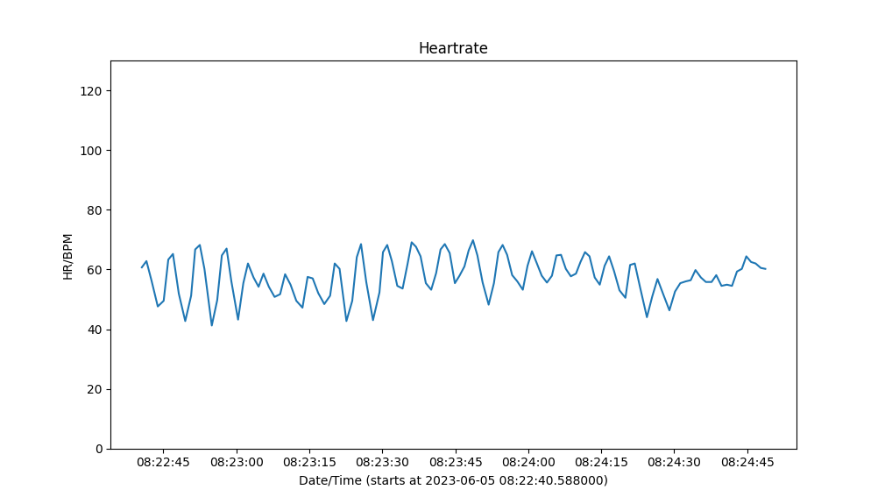

# heartrate_plot
Python and js scripts which plot the heartrate files from AttysECG and AttysHRV

## Python

Run `plot_hr.py` which plots the heartrate file and produces a plot similiar to the
one above.

## Javascript

Online demo: 

The sources are in `docs`.
